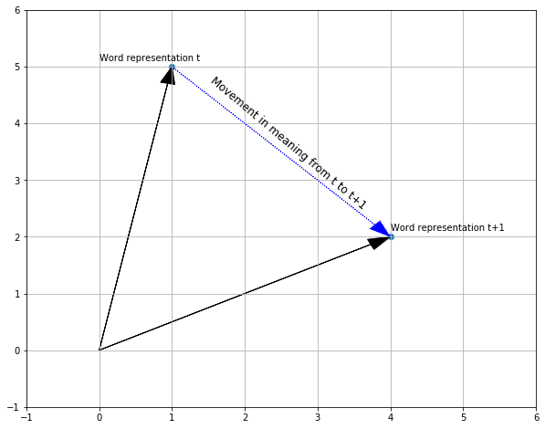

# Semantic Polarisation

Newspaper bias seem to be a source of constant debate in the UK. Bias can of course come in many forms; in what news a newspaper cover as well as how particular issues are being framed. How a newspaper choses to frame particular issues have been difficult to research in the past, beacuse the tools we have had to study text have often been to crude to pick up on subtle differences in the way words are used.

However, with the genesis of effective word embedding representations through the word2vec algorithm, we may start to be able to study these subtle differences. The vector representation of word meaning should allow us to quantify how words change over time between different corpora, which could be an important tool in understanding polarisation in language usage. 

In this notebook I will demonstrate how one can use such algorithms to study semantic polarisation in the news, by comparing the semantic change of the vocabulary used by two UK news outlets, from each side of the political spectrum, namely the Guardian (Left-Wing) and The Daily Mail (Right-Wing).

This approach requires us to chose two discrete time periods to compare. Because Brexit has been seen as a watershed moment in recent UK history, and one that has been said to magnify polarisation in the news, I will use the three years leading up to Brexit (2013-2015) and the three years from Brexit onwards (2016-2019) as discrete time periods.

The approach can briefly be summarised through the following steps:

* Compute separate word vectors for each outlet in each discrete time period.
* Align the 4 different word vector models onto a common space.
* For all common words between the 4 word vector models; compute a vector that represents its movement from time period t to time period t+1
* Look for words that have changed in opposite directions between the outlets; these are assumed to be polarising.

## Words and Vectors
One of the key insights from the Word2Vec algorithm was that we can *know a word by the company it keeps*. In other words, we can use the surrounding words from running text to infer the meaning of any given word. *Mikolov et al* showed how using a logistic regression trained to *'learn vector represenatations that are good at predicting nearby words*' could create word embeddings that captures semantic relationships between words that could be verified through simple arithmetic.

A common example is that analogies like *"man is to king as woman is to ...?"* can be found through simple vector addition and subtraction. 

For example; king - man + woman, will give you a vector close to the word 'queen'.

In other words; word vectors give a mathematical representation to each word in your corpus such that words that are used in a similar context will have a similar mathematical representation.

We measure similarity of two vectors by taking the cosine similarity of the two. Something interesting to note is that the cosine similarity only measures the angle between the two vectors; or in which way they are pointing, not the lenght of the vectors. The assumption is that meaning is only captured by the direction of the vector and not by its length. Some research suggest that the length of the vectors captures a combination of word frequency and how coherently a word is used. A word that is used in a narrow set of contexts will get a long vector, whilst words typically used in a wide array of context, like stop words, will get shorter vectors (*Schakel & Wilson, 2015*).

# Alignement

However, a general problem with wordembedding model is that they are not deterministic. Every model will come to a different solution, depending on random decisions in how the model is built.

Therefore, in order to compare words created from different models, we need a way to put all our models into a common space. A couple of solutions have been proposed, but one very intuitve and simple way is by finding a transformation matrix from each model onto a common space:

For each word in our model, we use that to predict itself and its N-nearest words in the space we are transforming it into. This is in essence a piecewise linear regression problem, where the predicted output is the wordvectors in its new space.

## Direction of Semantic Change

This idea that we can represent the meaning of words through vectors means we can track how words change over time by using simple arithmetical operations on vectors.

In our example with two discrete points in time; we can then create word embeddings for each of these two time periods, and measure the semantic change by calculating how the mathematical representation of a particular word has changed from one time period to the next.

This can be done by subtracting the vector of a word in *t* from the vector of that same word in *t+1*. This will give us a vector equivalent of one pointing from the tip of vector of a word in *t* and ending at the tip of the vector of that same word in *t+1*.

## Semantic Polarisation

So we can track the semantic change of a word from one period to the next, and with the same intuition we can get at semantic polarisation. For example if we calculate the direction of change of each word in both The Daily Mail and The Guardian from one time period to the next, we should also be able to compare whether the words are changing in the same, or the opposite direction.

The inutition is that words that change in the same direction will represent a general shift in language. However, a move in the opposite direction should indicate that the two outlets are increasingly using that word in different contexts from one another, and could give an insight into polarisation of word usage.

# Example Results

## Geopolitics

One of the words that have undergone a similar semantic change between the two outlets is 'Russia'. When looking at the words that 'Russia' has moved towards we find words associated with either speculation around Russian interference in Brexit, like *investigation*, or words possibly associated with the Salisbury incident like *murder*.

We can also note that 'Russia' has moved away from other countries as well as industries typically associated with Russia, like oil and gas.

One of the words that have undergone a dissimilar semantic change between the two outlets is 'Bejing'.

Whilst the Daily Mail seem to increasingly mention Beijing in the context of economic terms like *investment* and *supplier*, the Guardian is moving towards adjectives like *unfair* and *nice*.

You see a similar story in terms of what words 'Beijing' is moving away from in each of the outlets.

This change suggest that there has been a marked difference in the way that Beijing has been covered in the two outlets. We also see a difference when looking at the change of the word 'China' between the two outlets:

# Conclusions

Although the results shown above are fairly convincing, the approach seemed to work less well for other words that are not GeoPolitical entities. There are a number of possible technical reasons for this:

* Relatively small amounts of training data; each model is trained on somewhere between 14,600 and 26,000 articles, which is not a lot in the context of word vectors. Although there are no hard limits or even guidelines on sample sizes, most tend to agree that more data is better.

* The discrete time periods that were picked out are somewhat arbitrary. Picking two discrete point in time so near each other may be a bit too crude to capture big meaningful differences in changes in word vectors.

* The alignement algorithm. In this particular implementation I used all common words to find a linear transformation from the original space of the embedding to the new common space. This implicitly assumes that all the words have a similar representation across models. Some researchers suggest only using words that are likely to not be very different between models for the training of the transformation matrix; like stopwords (Azarbonyad et al., 2017). This may produce more pronounced differences.

Despite the approach needing some fine-tuning and experimentation, intial results suggest word vectors represent an interesting avenue for detecting changes in how language is used in the media.

# References
Azarbonyad, Hosein & Dehghani, Mostafa & Beelen, Kaspar & Arkut, Alexandra & Marx, Maarten & Kamps, Jaap. (2017). *Words are Malleable: Computing Semantic Shifts in Political and Media Discourse.* 1509-1518. 10.1145/3132847.3132878.

Kulkarni, Vivek & Al-Rfou, Rami & Perozzi, Bryan & Skiena, Steven. (2015). *Statistically Significant Detection of Linguistic Change.* 625-635. 10.1145/2736277.2741627.

Mikolov, Tomas & Sutskever, Ilya & Chen, Kai & Corrado, G.s & Dean, Jeffrey. (2013). *Distributed Representations of Words and Phrases and their Compositionality.* Advances in Neural Information Processing Systems. 26. 

Schakel, Adriaan & Wilson, Benjamin. (2015). *Measuring Word Significance using Distributed Representations of Words.*

Yougov: https://yougov.co.uk/topics/politics/articles-reports/2017/03/07/how-left-or-right-wing-are-uks-newspapers
